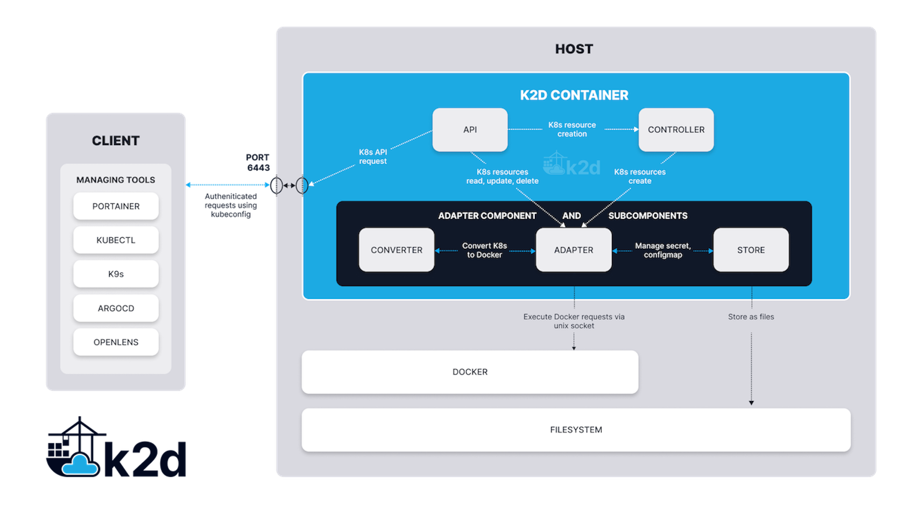

<!--truncate-->

For a long time, we have been watching the development of “lightweight” Kubernetes distributions and their marketing towards being used at the “edge”, and claiming to be ideal for IoT deployments.

Our own testing found that all 3 of the leading lightweight distributions still needed over 250MB of memory just to “idle” the Kubernetes instance. For most cases, we found that they actually needed closer to 400MB of RAM (just to deploy and sit idle, not even running any apps). 400MB is generally seen as very low memory consumption, and this is true when looked through the lens of deployment on an edge server, an Intel NUC with 8GB RAM, or even a Raspberry Pi4. But when we look at this through an Industrial IoT lens, the devices predominately being used in the field are ARM32 powered, and with only 1GB RAM. Losing almost half of that RAM just for the sole purpose of being able to be managed via a Kubernetes construct is crazy.

In addition to RAM consumption, all three of the lightweight Kubernetes distributions also require CPU cycles to maintain the Kubernetes state. This is predominantly for the scheduler reconciliation engine to run its looping process, but r'egardless, it's burning CPU cycles just to keep what's running, running. Finally, due to Kubernetes being a cluster orchestrator, even a single node deployment is treated as a cluster, and as such, requires a cluster quorum. This quorum is a database that resides on the local disk of the device, and maintaining this quorum involves disk IO. When your device is equipped with SD Cards, then this disk IO can cause early drive failures as previously discussed in this blog. Again, when you just need to manage a single device, this overhead is pointless.

So, what have we done about this?

The benefit of Kubernetes for the edge is actually higher order.

Kubernetes offers a universal language and consistent API for application deployments, and this universal language and API allows ISVs (and application support engineers) to consistently deploy their applications anywhere, everywhere, regardless of the underlying system configuration. Truly awesome. So Kubernetes at the edge allows engineering support staff to create a universal deployment script (YAML) for their industrial application stack (eg MQTT Broker, OPC-UA Gateway, Kafka, Node-Red, etc) and then use that stack to deploy their application on any type of hardware device, anywhere in their industrial landscape.

What's not important is actually RUNNING Kubernetes. What is important is being able to use the Kubernetes universal deployment language construct to deploy an application using the Kubernetes API. Given Kubernetes is “just” an orchestrator of container application deployments, what this actually means is being able to use the Kubernetes universal deployment language to deploy applications inside Containers.

So, Portainer has taken a different path to solving the problem of using Kubernetes at the Industrial Edge.

We are pleased to announce a new project, k2d.io (Kubernetes to Docker), a Kubernetes to Docker API translator.

k2d.io is a simple, single-container deployment that runs on either Docker or Podman-enabled Linux devices (ARM, ARM32, x86, x86-64). k2d implements a cut-down Kubernetes API server that listens for inbound Kubernetes API instructions, and then decodes the intent of the instruction, translates it (in real-time) to the corresponding Docker API commands, and then executes these Docker commands directly on the device. In effect, it allows you to control a remote Docker instance using kubectl CLI running on engineer laptops, or using Kubernetes native toolsets. k2d is NOT Kubernetes, it’s an API translator. As such, the overhead to run the translator is tiny, in the order of 22MB, really low CPU overhead
(and only when executing commands, no CPU used when not actively translating), and almost no disk IO.

Why do we think this is important?

Simple really. There are millions of Industrial Compute devices out there in the field that are capable of running Linux and Docker (often via a simple firmware update), and yet these devices are entirely unserviceable by the lightweight Kubernetes distributions. We want to get these existing assets reusable in the Industry 4 world, and that means modernizing. In the Industry 4 world, this is known as “brownfields” or “retro-fit”, and that’s exactly what we want to do. Make what was old, new, through a simple “bolt-on” accessory (in our case, a software container).

Do we think this is awesome? We sure do! We think it's going to enable a really high degree of standardization across the Industrial Edge, without having to force new hardware purchases, or accepting a massive loss of usable RAM.

Our version 0.1 alpha release (available soon on k2d.io) implements a select few Kubernetes API endpoints, but we plan to expand this based on community feedback. Remember, we are not trying to replace lightweight Kubernetes, and we still recommend these be used where the hardware is sufficient. So we will really limit the API endpoints we implement to only those absolutely needed for the specific use case intended for k2d.

