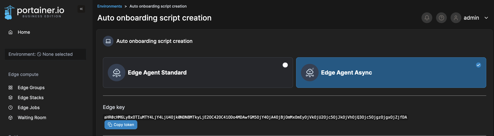
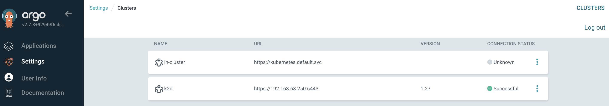

# Custom k2d Port

The port exposed for `k2d` can be customized through the use of the environment variable `--env K2D_PORT=XXXX`.

# Increasing Docker Client Timeout

The default timeout for activities triggered by the Docker client is `10` minutes.

For certain devices leveraging an SD card, the pull and extract of an image might be a bottleneck. In this case, use the environment variable `K2D_DOCKER_CLIENT_TIMEOUT` to increase the timeout value.

# Portainer Integration

`k2d` integrates with Portainer natively.

:::info

Only the Portainer Business Edition Edge Async type is supported by `k2d`

:::

To enable it, specify the following environment variables as part of the execution:

-   `PORTAINER_EDGE_KEY` that can be obtained from the `Environments` -> `Auto onboarding script creation` -> `Edge Agent Async` page:



-   (Optional) `PORTAINER_EDGE_ID` to define the unique name of the device where k2d is running. The common case will be to grab the unique identifier of the edge device. If not specified, a random UUID will be generated
-   Note that Portainer agent does not run on ARMv6 hardware, so you are unable to use this integration on that platform.

Below is an example:

```bash
docker run -d \
  --name k2d \
  --network host \
  --restart always \
  --env K2D_ADVERTISE_ADDR=${YOUR_HOST_IP} \
  --env K2D_SECRET=${YOUR_OWN_SECRET} \
  --env PORTAINER_EDGE_ID=$(uuidgen) \
  --env PORTAINER_EDGE_KEY=${EDGE_KEY}\
  --volume /var/run/docker.sock:/var/run/docker.sock \
  --volume /var/lib/k2d:/var/lib/k2d \
  portainer/k2d:1.0.0-beta
```

This will deploy K2D, the Portainer Kubernetes Edge Async Agent, and the device will appear in the "waiting room" on your configured Portainer Business instance.

# Using a different backend storage

By default, k2d will store the content of ConfigMap and Secret objects as files inside its data folder (default is `/var/lib/k2d)`.

It is possible to change this behavior at startup to use Docker volumes for storage instead, this can be done by specifying the `K2D_STORE_BACKEND="volume"` environment variable:

```bash
docker run -d \
  --name k2d \
  --network host \
  --restart always \
  --env K2D_ADVERTISE_ADDR=${YOUR_HOST_IP} \
  --env K2D_SECRET=${YOUR_OWN_SECRET} \
  --env K2D_STORE_BACKEND="volume" \
  --volume /var/run/docker.sock:/var/run/docker.sock \
  portainer/k2d:1.0.0-beta
```

Using this approach, it is not necessary to bind mount the path to k2d data folder (`--volume /var/lib/k2d:/var/lib/k2d`) anymore as all the data managed by k2d will be stored inside Docker volumes.

:::warning

This storage currently has a limitation over the default "disk" storage. As Docker volumes cannot be deleted while they are being used, you might face unable to remove resource errors when trying to remove a ConfigMap or a Secret. This scenario is likely to happen if your ConfigMap or Secret resources are defined before your workloads inside a manifest file and that you are trying to delete that manifest. See the example below.

:::

```bash
# We deploy our manifest
> kubectl apply -f app.yml
configmap/app-config created
secret/app-secret created
deployment.apps/app-deployment created
service/my-app-service created

# We then try to delete it
> kubectl delete -f app.yml
deployment.apps "app-deployment" deleted
service "my-app-service" deleted
Error from server (InternalError): error when deleting "/src/tests/manifests/deployment-2.yml": an error on the server ("unable to delete configmap: unable to remove Docker volume: Error response from daemon: remove k2d-configmap-default-app-config: volume is in use - [c7f555532b617230072e243f412cebdaba860f12e087784bfe459c8e02ab4431]") has prevented the request from succeeding (delete configmaps app-config)
Error from server (InternalError): error when deleting "/src/tests/manifests/deployment-2.yml": an error on the server ("unable to delete secret: unable to remove Docker volume: Error response from daemon: remove k2d-secret-default-app-secret: volume is in use - [c7f555532b617230072e243f412cebdaba860f12e087784bfe459c8e02ab4431]") has prevented the request from succeeding (delete secrets app-secret)

# As a workaround for this issue, you can simply execute the deletion again
> kubectl delete -f app.yml
configmap "app-config" deleted
secret "app-secret" deleted
deployment.apps "app-deployment" deleted
service "my-app-service" deleted
```

# ArgoCD Integration

The device where `k2d` runs can be treated as a single-node Kubernetes cluster managed by ArgoCD.

:::info

Use of the argocd command line tool to add it as a cluster has yet to be supported (argocd cluster add k2d).

:::

To onboard the device as an ArgoCD managed target, create an ArgoCD cluster secret with the `tlsClientConfig` specifying the certificate details from `k2d`. To obtain the CA, cert, and key files, you will need to copy the files directly from the container and convert them to `base64` format.

Below is an example run to grab and encode the certificate files:

```bash
docker cp k2d:/var/lib/k2d .
cat k2d/token | base64
cat k2d/ssl/ca.pem | base64
cat k2d/ssl/cert.pem | base64
cat k2d/ssl/key.pem | base64
```

With the output above, create a secret as per below:

```yaml
apiVersion: v1
kind: Secret
metadata:
    name: k2d-cluster-secret
    labels:
        argocd.argoproj.io/secret-type: cluster
    namespace: argocd
type: Opaque
stringData:
    name: k2d
    server: https://10.114.0.2:6443
    config: |
        {
          "tlsClientConfig": {
            "bearerToken": "${BEARER_TOKEN}",
            "caData": "${CA_ENCODED}",
            "certData": "${CERT_ENCODED}",
            "keyData": "${KEY_ENCODED}"
          }
        }
```

Now, navigate to `Settings` -> `Clusters`; you will see the `k2d` endpoint within the ArgoCD UI:



:::warning

Be aware that your manifest has to include Kubernetes resources that are supported by k2d

:::
