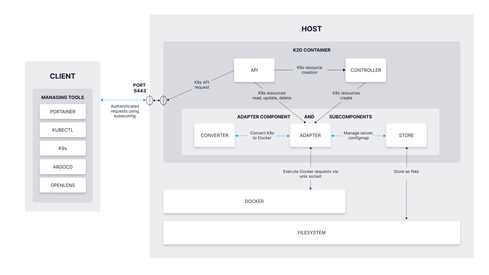

The diagram below highlights the internal architecture of K2D.

Note that from a client side, the most common Kubernetes tools have been validated against K2D's API.

On the Docker Host, the K2D system operates completely within a single container, which includes the controller, the API server, and the translator.
